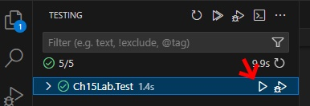
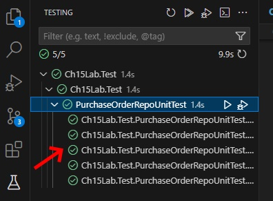
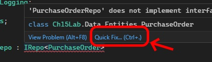
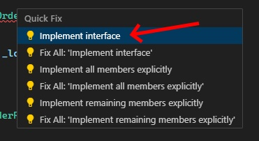

# Build the Data Access Layer
for this project, you will follow instructions below to create and test a Data Access Layer Library for Purchase Order System.

### Project is working.
- you must clone it from Github.
- once cloned, in the root folder for Ch15Lab, you will need to update the nuget libraries
  - in terminal window type command: `dotnet restore`
- do an initial build with terminal command: `dotnet build`
- now the Testing icon in VS Code should enable you to run tests.
  - 
  - Yours icon list may not be exactly the same as mine...
- Run all the test by Pressing the Play button for all test.
  - 
  - they all should be green.
  - 

### Requirements Changed.
- Client wants the Customer to have Many Addresses
  - We will need to add an AddressType for Shipping, Billing, or Both.
  - So the Customer can pull up all the address assigned to them and set the BillTo and the ShipTo on the Purchase Order.
  - The Customer will need to add, update, and delete all the addresses by a list of addresses.
  - Create Tests to check if customer addresses are working.

### Part 1: Add the Address Type.
- in the Ch15Lab.Data.Entities we need to add the `AddressType.cs` file.
- the AddressType has 2 properties, int AddressTypeId and the string Description set to null!... just like the OrderStatus.
- to link the AddressType to Address
  - Add the collection of Address property called Addresses to AddressType class and set to a new List<Address>()
  - add the virtual AddressType property to Address class, set to null!;
  - and add the property, int AddressTypeId.
- next we edit the POManagerContext to logically link them.
  - add the DbSet<AddressType> AddressTypes near the top of the code.
  - in the OnModelCreating just after the Address model builder we add a new model builder.
``` csharp
modelBuilder.Entity<AddressType>(entity =>
{
    entity.ToTable("AddressType");

    entity.Property(e => e.AddressTypeId)
        .ValueGeneratedNever();

    entity.HasData(
        new AddressType() { AddressTypeId = 91, Description = "Billing" },
        new AddressType() { AddressTypeId = 92, Description = "Shipping" },
        new AddressType() { AddressTypeId = 93, Description = "Both" }
    );
});
```
- - That is enough for Entity Framework to know what is happening.
  - Now we need to update the seed data in Address to set AddressTypeId
    - where AddressId = 10001, add AddressTypeId = 91
    - where AddressId = 10002, add AddressTypeId = 92
    - where AddressId = 10003, add AddressTypeId = 93
  - Now very important to update the Test.
    - Open the Ch15Lab.Test.PurchaseOrderRepoUnitTest and in the AddPO_Success we need to add the AddressTypeId = 93 in each new Address.

### Part 2: Create Many to Many relation.
- in the Ch15Lab.Data.Entities we need to edit the Customer 
  - remove the AddressId and the Address properties.
  - Add the collection of Address property name Addresses.
    - set equal to new List<Address>()
- in the Address class
  - We already have a collection of Customer
- now edit the POManagerContext by adding the Fluent code to the Customer modelBuilder.
  - remove the current entity.HasOne that connects 1 Address.
  - add the Many to many...
``` csharp
entity.HasMany(d => d.Addresses)
    .WithMany(p => p.Customers)
    .UsingEntity (
        ac => ac.HasData(
            new  { AddressesAddressId = 10001, CustomersCustomerId = 1001 },
            new  { AddressesAddressId = 10002, CustomersCustomerId = 1001 }
    )
);
```  
  - the HasMany... and WithMany makes perfect sense.
  - the UsingEntity is a way we can seed a table that is not represented in code but generate by Entity Framework.
  - next we need to remove the AddressId from Customer Seed data.

### Part 3: Migrate and Update database.
- Save All Changes!
- in Terminal in the root folder... execute the `dotnet build`
- once successful, we want to generate a new Migration...
  - move Terminal into the Ch15Lab.Data Folder
  - in terminal ecdxecute: `dotnet ef migrations add ManyToManyCustomerAddresses`
  - next execute: `dotnet ef database update`
  - no errors.

### Part 4: Create the Repository.
- in the Ch15Lab.Data.Repos we have an Interface for a Generic Repo and a Puchase Order Repo.
- add a new file ICustomerRepo.cs 
  - add the namespace and the interface ICustomerRepo
  - add a Method interface, `void SetAddresses(int idCustomer, IEnumerable<Address> addresses);`
  - this is to add, update, and delete Addresses from Customer.
- add a new file CustomerRepo.cs
  - add the namespace and the CustomerRepo class that implements both the IRepo<Customer> and the ICustomerRepo interfaces...
  - you should be able to hover over the interfaces and select Quick Fix.
    - 
    - 
  - This Repository has the idea that NO Exceptions will pass through
    - Any issues will be logged and null returns.
  - We need to implement the Get, Set, Add, and the SetAddresses... not the Delete.
  - Use the Purchase Oder Repo as an example, 
  - Create the constructor with logger and context.
  - The Get we need to Include Addresses Only.
  - Now the SetAddresses with the customer id and a list of addresses to fix.
    - first line... we get all the addresses that are currently assigned to customer with this bit of code.
```csharp
var addressDictionary = _db.Customers
    .AsNoTracking()
    .Include(c => c.Addresses)
    .SelectMany(c => c.Addresses)
    .ToDictionary(c => c.AddressId, c => c);
```
- - - it's a dictionary so we can look up the id quickly.
    - now we get that customer.
```csharp
var customer = _db.Customers.Find(idCustomer);
if (customer == null)
    return;
```
- - - we can use this customer to update.
    - next we loop through each address in the list parameter.
    - we check if the AddressId is 0... that means it's an insert.
    - else check if address id is in dictonary
      - we update the address, and remove it from the dictonary.
      - we will end up with the dictonary containing all the address to unassign.
    - else we update and assign the address.
    - all the time, we log what is happening.
```csharp
foreach (Address addr in addresses) 
{
    if (addr.AddressId == 0) 
    {   // New Address
        customer.Addresses.Add(addr);
        _logger.LogInformation($"Set Customer {idCustomer} create new Address { addr.Title }");
    }
    else if (addressDictionary.ContainsKey(addr.AddressId)) 
    {   // Update but already assigned.
        _logger.LogInformation($"Set Customer {idCustomer} updated Address { addr.Title }");
        addressDictionary.Remove(addr.AddressId);
    }
    else 
    {   // Update and assign.
        _db.Addresses.Update(addr);
        customer.Addresses.Add(addr);
        _logger.LogInformation($"Set Customer {idCustomer} referenced and updated Address { addr.Title }");
    }
}
// Remove References...
foreach (Address addr in addressDictionary.Values)
{
    customer.Addresses.Remove(addr);
}

_db.SaveChanges();
```
- - - This shows that the Repository can do complex things with a clean interface.

### Part 5: Test the new Repository.
- We need to fix the Data layer by removing the OnConfiguring override in POManagerContext... this was used to generate Migration but now it will cause issues with the Test Project.  I just remarked out the 4 lines.
- Now we go into the Ch15Lab.Test Project.
- Add a new file called CustomerRepoUnitTest.cs 
  - Add the namespace and the class.
  - Add the constructor (no params)
  - We need to create a Fake Context to inject into the Repos, see the PurchaseOrderRepoUnitTest.cs for how that is done.
  - Create a memory Sqlite connection.
  - Open it
  - Use DbContextOptionsBuilder to build the Options using Sqlite with the memory connection.
  - Create a POManagerContext with the options.  Keep the _db in readonly private property.
  - Use the _db.Database.EnsureCreated to run the migration scripts and setup the database with init data we can use to test with.
```csharp
using var connection = new SqliteConnection("DataSource=file::memory:?cache-shared");
connection.Open();

var opt = new DbContextOptionsBuilder<POManagerContext>()
    .UseSqlite(connection)
    .Options;

_db = new POManagerContext(opt);
_db.Database.EnsureCreated();
```
- Create a new AddCustomer_Success test (use the Fact attribute)
  - In the code below...
    - We create a CustomerRepo with NullLogger and our _db
    - Generate a new customer with Addresses.
    - Call the Add(customer) and assign the output to new customer...
    - We check a few things aganst the new cutomer to pass our test.
``` csharp
// Given
CustomerRepo repoCustomer = new CustomerRepo(NullLogger<CustomerRepo>.Instance, _db);
Address address = _db.Addresses.First();

// When
var customer = new Customer()
{
    CustomerId = 0, // Insert.
    Name = "Test Customer Insert",
    Addresses = new List<Address>()
    {
        address,
        new Address()
        {
            AddressId = 0,
            AddressTypeId = 91, // Billing Address
            Title = "Test1 Added Address",
            Street = "702 Van Buren St",
            City = "Fort Wayne",
            StateId = 17, // Illinois
            PostalCode = "46802"
        }
    }
};

// Then
var customerNew = repoCustomer.Add(customer);

Assert.NotNull(customerNew);
Assert.NotEqual(0, customerNew?.CustomerId);
Assert.Equal("Test Customer Insert", customerNew?.Name);
```
- Create new test for SetCustomerAddresses_Success (use the Fact attribute)
  - In the code below...
    - We generate the repo from NullLogger and _db
    - Get pull the first Customer and get there Id.
    - We use repo to Get the Customer with Id and pull out its addresses.
    - With the list we remove the 1st one
    - And add a new Address.
    - Then call the repos SetAddresses with the id and the list we just crated.
    - To test a void, we want to check if any Exception has been Thrown.
```csharp
CustomerRepo repoCustomer = new CustomerRepo(NullLogger<CustomerRepo>.Instance, _db);
int idCustomer = _db.Customers.First().CustomerId;

var customer = repoCustomer.Get(idCustomer);
var addresses = customer?.Addresses.ToList();
if (customer is null || addresses is null || !addresses.Any())
    return;

// Remove the First Address from list.
addresses.Remove(addresses[0]);

// Add a new address...
addresses.Add(new Address()
{
    AddressId = 0,
    AddressTypeId = 91, // Billing Address
    Title = "Test2 Added Address",
    Street = "2000 Ogden Ave",
    City = "Aurora",
    StateId = 17, // Illinois
    PostalCode = "60504"
});

var ex = Record.Exception(() => repoCustomer.SetAddresses(idCustomer, addresses));
Assert.Null(ex);
```
- Now we add the last test... SetCustomer_Success (use the Fact attribute)
  - In the code below...
    - Much like the SetAddresses we generate repo and grab the 1st customer
    - Pull out the Addresses assigned to the customer
    - We remove one and add one like before.
    - But we just use the Set(customer) and check the returned customer data.
```csharp
CustomerRepo repoCustomer = new CustomerRepo(NullLogger<CustomerRepo>.Instance, _db);
int idCustomer = _db.Customers.First().CustomerId;

var customer = repoCustomer.Get(idCustomer);
var addresses = customer?.Addresses.ToArray();
if (customer is null || addresses is null || !addresses.Any())
    return;

// remove the first address...
customer.Addresses.Remove(addresses[0]);

// add a new address...
customer.Addresses.Add(new Address()
{
    AddressId = 0,
    AddressTypeId = 91, // Billing Address
    Title = "Test3 Added Address",
    Street = "1506 S Oneida St",
    City = "Appleton",
    StateId = 55, // WI
    PostalCode = "54915"
});

var customerNew = repoCustomer.Set(customer);

Assert.NotNull(customerNew);
Assert.NotEqual(0, customerNew?.CustomerId);
```
- Now we are ready to run these tests... 
  - First Save all files and build from root directory.
  - I would run them in Debug mode for the first few times
  - Set some break points and make sure its doing thing correctly.
  - I am sure there will be issues to fix.

### Learned and Extra Credit.
- I created this to help us understand the Repository and the Data Access Layer (which is an old term but still fits the best.)
- I learned that Entity Framework core is incredible... 
  - all the work we did for SetAddresses to add, set, and delete the assigned address is done with one command in core... Update(entity)
  - still very good knowledge since not everyone uses the newest EF Core.
  - testing is a pain... but once it's setup, it works well.

- under Code Review: I did something wrong with SetAddresses
  - extra credit, fix what I did wrong and fix the test to test it.
